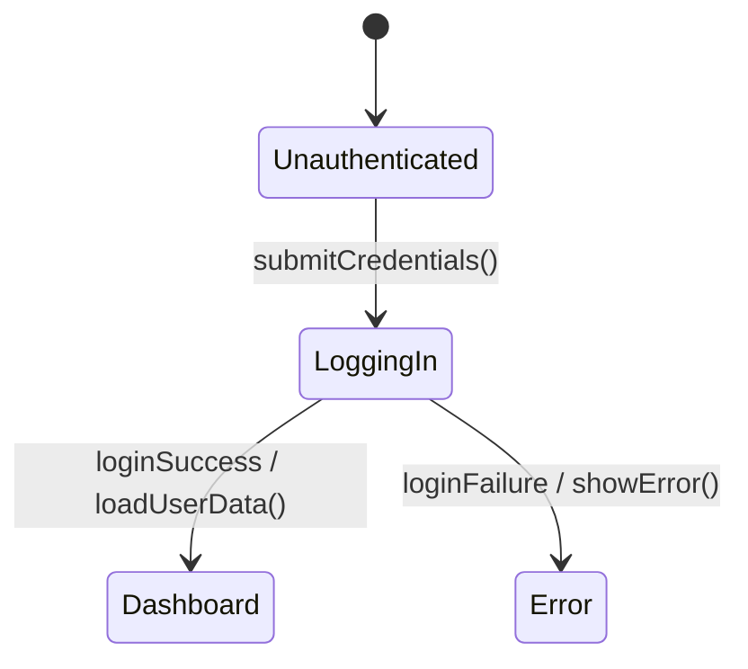
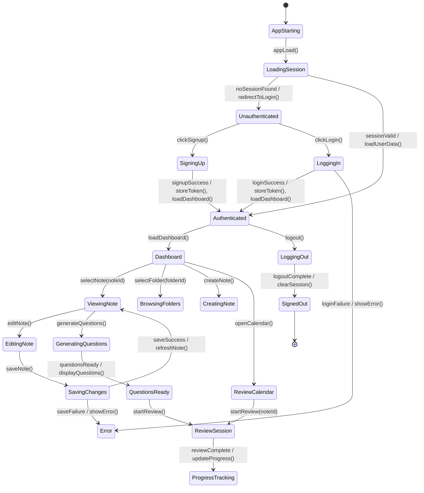

# Mermaid State Diagram Generation Prompts

## Overview
This document contains prompts for generating one complete Mermaid state diagram that represents the entire student-notebook-llm system. The diagram should model the system like a UML state machine, similar to the example lift controller image, with states, transitions, guards, events, and entry/do/exit actions.

The goal is a single state diagram that shows the major user and system flows from startup through authentication, note management, question generation, review scheduling, progress tracking, and logout.

---

## Mermaid State Diagram Rules

Use Mermaid state diagram syntax, preferably `stateDiagram-v2`.

### Required syntax patterns
- Initial state: `[*] --> SomeState`
- Transition with event: `StateA --> StateB : event()`
- Transition with guard: `StateA --> StateB : event() [condition]`
- Transition with action: `StateA --> StateB : event() / action()`
- State actions:
  - `entry / action()`
  - `do / action()`
  - `exit / action()`

### Example

---

## System Scope

The diagram should cover the full application lifecycle for the student-notebook-llm project:

- App launch and initial loading
- Unauthenticated user flow
- Signup and login flow
- Main dashboard flow
- Folder browsing flow
- Note viewing and editing flow
- Note creation and deletion flow
- Question generation flow
- Review scheduling and review session flow
- Calendar and progress tracking flow
- Error handling and recovery
- Logout and session end

---

## Recommended Top-Level States

The final diagram should include one main system state machine with these major states:

- `AppStarting`
- `LoadingSession`
- `Unauthenticated`
- `SigningUp`
- `LoggingIn`
- `Authenticated`
- `Dashboard`
- `BrowsingFolders`
- `ViewingNote`
- `CreatingNote`
- `EditingNote`
- `DeletingNote`
- `GeneratingQuestions`
- `ReviewCalendar`
- `ReviewSession`
- `ProgressTracking`
- `SavingChanges`
- `SyncingData`
- `Error`
- `LoggingOut`
- `SignedOut`

You may use nested states if that makes the diagram clearer, but the final output must still be one unified system diagram.

---

## Prompt 1: Full System State Diagram

**Task**: Generate one complete Mermaid state diagram for the entire student-notebook-llm system.

**Requirements**:
- Use `stateDiagram-v2`
- Include only one top-level diagram for the whole system
- Show a clear initial state and final state
- Model the major user workflow transitions
- Include guards, events, and transition actions
- Use entry/do/exit actions where appropriate
- Show error handling and recovery paths
- Make the diagram readable and logically ordered

**Suggested structure**:
1. App launch and session loading
2. Authentication flow
3. Dashboard and navigation flow
4. Note interaction flow
5. Question generation flow
6. Review and progress flow
7. Logout and session termination

---

## Prompt 2: Authentication Flow States

**Task**: Model the authentication lifecycle in the state diagram.

**States to include**:
- `Unauthenticated`
- `SigningUp`
- `LoggingIn`
- `Authenticated`
- `SessionExpired`
- `LoggingOut`
- `SignedOut`

**Transitions to include**:
- `clickSignup()`
- `submitSignupForm()`
- `signupSuccess`
- `signupFailure`
- `clickLogin()`
- `submitLoginForm()`
- `loginSuccess`
- `loginFailure`
- `logout()`
- `sessionExpired()`

**Actions and guards**:
- `loginSuccess / storeToken(), loadUserProfile()`
- `loginFailure / showErrorMessage()`
- `sessionExpired / clearToken(), redirectToLogin()`
- `logout() / clearSession(), navigateHome()`

---

## Prompt 3: Dashboard and Navigation States

**Task**: Model the main in-app navigation state.

**States to include**:
- `Dashboard`
- `BrowsingFolders`
- `ViewingNote`
- `CreatingNote`
- `EditingNote`
- `DeletingNote`
- `SavingChanges`
- `SyncingData`

**Transitions to include**:
- `selectFolder(folderId)`
- `selectNote(noteId)`
- `createNote()`
- `editNote()`
- `saveNote()`
- `deleteNote()`
- `saveSuccess`
- `saveFailure`
- `deleteSuccess`
- `deleteFailure`

**Actions and guards**:
- `saveNote() / validateForm(), persistNote()`
- `saveSuccess / refreshList(), updateState()`
- `deleteSuccess / removeFromList(), refreshDashboard()`
- `saveFailure / showError(), keepEditing()`

---

## Prompt 4: Question Generation States

**Task**: Model how a note moves through the question generation workflow.

**States to include**:
- `ViewingNote`
- `GeneratingQuestions`
- `QuestionsReady`
- `AnsweringQuestions`
- `ReviewingAnswers`

**Transitions to include**:
- `generateQuestions()`
- `questionsReady`
- `submitAnswers()`
- `reviewComplete()`
- `generationFailure`

**Actions and guards**:
- `generateQuestions() / callBackend(), waitForLLMResponse()`
- `questionsReady / displayQuestions()`
- `generationFailure / showGenerationError()`
- `reviewComplete / storeResponses(), updateProgress()`

---

## Prompt 5: Review Scheduling and Review Session States

**Task**: Model spaced repetition and review session behavior.

**States to include**:
- `ReviewCalendar`
- `ReviewDue`
- `ReviewSession`
- `SubmittingReview`
- `ReviewCompleted`
- `ReschedulingReview`

**Transitions to include**:
- `openCalendar()`
- `reviewDue(date)`
- `startReview(noteId)`
- `submitReview(result)`
- `reviewSaved`
- `rescheduleNeeded`
- `scheduleUpdated`

**Actions and guards**:
- `startReview(noteId) / loadReviewData(), openSession()`
- `submitReview(result) / calculateNextReviewDate()`
- `reviewSaved / persistResults(), updateStats()`
- `rescheduleNeeded / updateSchedule()`

---

## Prompt 6: Progress Tracking States

**Task**: Model the progress tracking and analytics flow.

**States to include**:
- `ProgressTracking`
- `LoadingStatistics`
- `DisplayingStatistics`
- `RefreshingStatistics`

**Transitions to include**:
- `openProgressPage()`
- `loadStats()`
- `statsLoaded`
- `refreshStats()`
- `statsRefreshSuccess`
- `statsRefreshFailure`

**Actions and guards**:
- `loadStats() / fetchReviewHistory(), calculateCompletionRate()`
- `statsLoaded / renderCharts(), showMetrics()`
- `statsRefreshFailure / showError()`

---

## Prompt 7: Error and Recovery States

**Task**: Include error handling across the whole system.

**States to include**:
- `Error`
- `Retrying`
- `Recovering`

**Transitions to include**:
- `requestFailed`
- `retry()`
- `recover()`
- `dismissError()`

**Actions and guards**:
- `requestFailed / logError(), displayMessage()`
- `retry() [networkAvailable] / resendRequest()`
- `recover() / restorePreviousState()`
- `dismissError() / clearErrorBanner()`

The diagram should show that errors can return the system back to the appropriate prior state.

---

## Prompt 8: One Big Diagram Requirement

**Task**: Keep everything in one diagram.

**Requirements**:
- Do not split the output into multiple state diagrams
- Do not generate separate files for auth, notes, reviews, or progress
- The final answer must be one large state machine that represents the whole app
- Use subgraphs or grouped regions only if Mermaid state syntax supports it cleanly and it improves readability
- Keep the flow understandable from start to finish

---

## Prompt 9: Attribute-Like State Metadata

**Task**: Include state descriptions in labels when helpful.

**Examples**:
- `Dashboard : entry / loadFolders(), loadNotes()`
- `ViewingNote : do / renderNoteDetails()`
- `EditingNote : entry / loadEditor()`
- `SavingChanges : do / persistToServer()`
- `ReviewSession : entry / loadReviewCard()`

Use this to make the state diagram more informative and closer in spirit to a detailed UML state machine.

---

## Prompt 10: Validation Requirements

**Task**: Ensure the generated diagram is valid and readable.

**Checklist**:
- Mermaid syntax must compile without errors
- Transitions must use correct state diagram arrow syntax
- Guards must be written in square brackets
- Actions must use `/ action()` format
- Entry, do, and exit actions must be placed correctly
- State names should be descriptive and consistent
- The diagram must remain readable even though it is large
- The output should be suitable for Mermaid Live Editor and GitHub Markdown

---

## Final Prompt Template

Use this as the main prompt when generating the diagram:

**Prompt**:
Create one complete Mermaid `stateDiagram-v2` for the entire student-notebook-llm system. Model the application like a UML state machine, similar to a lift controller state diagram, with a clear initial state, transitions, guards, and actions. Include the full system lifecycle: app startup, authentication, dashboard navigation, note creation and editing, question generation, review scheduling, review sessions, progress tracking, error handling, logout, and signed-out completion. Use correct Mermaid state syntax with `event [guard] / action` transitions and `entry`, `do`, and `exit` actions inside states. Make it one big diagram, not multiple diagrams, and ensure it renders cleanly in Mermaid Live Editor.

---

## Example Skeleton

---

## Success Criteria

The generated state diagram should:
- Show the complete system lifecycle in one diagram
- Use the correct Mermaid state diagram syntax
- Include meaningful state names and transitions
- Include guards, actions, and entry/do/exit behaviors
- Reflect the application flow clearly
- Be readable and useful as system documentation
- Render correctly in Mermaid Live Editor and Markdown viewers

