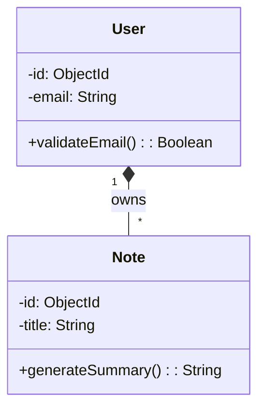

# Mermaid UML Class Diagram Generation Prompts

## Overview
This document contains detailed prompts for generating a comprehensive UML class diagram in Mermaid that represents the entire student-notebook-llm system. The diagram will show all classes, their attributes, methods, and relationships with proper relationship arrows.

---

## Mermaid Relationship Arrow Reference

Before implementing, understand these key Mermaid class diagram relationship arrows:

| Arrow Type | Meaning | Syntax |
|-----------|---------|--------|
| Inheritance | Child extends Parent | `ChildClass --|> ParentClass` |
| Realization | Implements interface | `Class ..\|> Interface` |
| Composition | Strong "owns" relationship | `ClassA *-- ClassB` |
| Aggregation | Weak "has" relationship | `ClassA o-- ClassB` |
| Association | General relationship | `ClassA -- ClassB` |
| Directed Association | One-way relationship | `ClassA --> ClassB` |
| Multiplicity | Cardinality | `"1"`, `"*"`, `"0..1"`, `"1..*"` |

**Example with multiplicity**:
```
User "1" -- "*" Note : owns
```

---

## Core System Classes to Include

### Domain Models (Backend/src/models/)

#### User Class
- **Attributes**:
  - `id: ObjectId`
  - `email: String (unique)`
  - `passwordHash: String`
  - `createdAt: Date`
  - `updatedAt: Date`
  - `preferences: Object`

- **Methods**:
  - `validateEmail(): Boolean`
  - `hashPassword(password): String`
  - `comparePassword(plaintext): Boolean`
  - `getProfile(): Object`

#### Note Class
- **Attributes**:
  - `id: ObjectId`
  - `userId: ObjectId (FK)`
  - `folderId: ObjectId (FK, nullable)`
  - `title: String`
  - `content: String`
  - `summary: String (nullable)`
  - `createdAt: Date`
  - `updatedAt: Date`
  - `tags: Array<String>`

- **Methods**:
  - `generateSummary(): String`
  - `updateContent(newContent): void`
  - `delete(): void`
  - `getRelatedNotes(): Array<Note>`

#### Folder Class
- **Attributes**:
  - `id: ObjectId`
  - `userId: ObjectId (FK)`
  - `name: String`
  - `color: String`
  - `createdAt: Date`
  - `updatedAt: Date`

- **Methods**:
  - `addNote(noteId): void`
  - `removeNote(noteId): void`
  - `getNotes(): Array<Note>`
  - `rename(newName): void`
  - `delete(): void`

#### ReviewSession Class
- **Attributes**:
  - `id: ObjectId`
  - `noteId: ObjectId (FK)`
  - `userId: ObjectId (FK)`
  - `reviewResults: Array<Object>`
  - `nextReviewDate: Date`
  - `reviewCount: Number`
  - `difficulty: Number (1-5)`
  - `createdAt: Date`
  - `updatedAt: Date`

- **Methods**:
  - `submitReview(result): void`
  - `calculateNextReviewDate(): Date`
  - `updateDifficulty(level): void`
  - `getHistory(): Array<Object>`

#### ReviewSchedule Class
- **Attributes**:
  - `id: ObjectId`
  - `userId: ObjectId (FK)`
  - `noteIds: Array<ObjectId>`
  - `frequency: String` (daily, weekly, monthly)
  - `lastScheduledDate: Date`
  - `nextScheduleDate: Date`
  - `isActive: Boolean`

- **Methods**:
  - `scheduleReviews(): Array<ReviewSession>`
  - `updateFrequency(frequency): void`
  - `addNoteToSchedule(noteId): void`
  - `removeNoteFromSchedule(noteId): void`

### Repository Layer (Backend/src/models/*Repository.js)

#### UserRepository
- **Attributes**:
  - `collection: MongoCollection`

- **Methods**:
  - `create(userData): User`
  - `findById(id): User`
  - `findByEmail(email): User`
  - `update(id, data): User`
  - `delete(id): Boolean`
  - `findAll(filter): Array<User>`

#### NoteRepository
- **Attributes**:
  - `collection: MongoCollection`

- **Methods**:
  - `create(noteData): Note`
  - `findById(id): Note`
  - `findByUserId(userId): Array<Note>`
  - `findByFolderId(folderId): Array<Note>`
  - `update(id, data): Note`
  - `delete(id): Boolean`
  - `search(query): Array<Note>`

#### FolderRepository
- **Attributes**:
  - `collection: MongoCollection`

- **Methods**:
  - `create(folderData): Folder`
  - `findById(id): Folder`
  - `findByUserId(userId): Array<Folder>`
  - `update(id, data): Folder`
  - `delete(id): Boolean`

#### ReviewSessionRepository
- **Attributes**:
  - `collection: MongoCollection`

- **Methods**:
  - `create(sessionData): ReviewSession`
  - `findById(id): ReviewSession`
  - `findByNoteId(noteId): ReviewSession`
  - `findByUserId(userId): Array<ReviewSession>`
  - `update(id, data): ReviewSession`
  - `delete(id): Boolean`
  - `findDueForReview(userId): Array<ReviewSession>`

#### ReviewScheduleRepository
- **Attributes**:
  - `collection: MongoCollection`

- **Methods**:
  - `create(scheduleData): ReviewSchedule`
  - `findById(id): ReviewSchedule`
  - `findByUserId(userId): ReviewSchedule`
  - `update(id, data): ReviewSchedule`
  - `delete(id): Boolean`

### Service Layer (Backend/services/)

#### ReviewScheduler Service
- **Attributes**:
  - `scheduleRepository: ReviewScheduleRepository`
  - `reviewSessionRepository: ReviewSessionRepository`
  - `noteRepository: NoteRepository`
  - `interval: Number`

- **Methods**:
  - `startScheduler(): void`
  - `stopScheduler(): void`
  - `processSchedules(): void`
  - `calculateReviewDates(noteIds): Array<Date>`
  - `notifyUserForReview(userId): void`

### Frontend Components (React)

#### Components
- **Props**: Array of expected props
- **Methods**:
  - `useState()`: State management
  - `useEffect()`: Side effects
  - `handleClick()`: Event handlers
  - `render()`: UI rendering

#### Key Components to Include
- **AppLayout**: Main layout wrapper
- **FoldersSidebar**: Folder navigation
- **FolderItem**: Individual folder
- **NoteCard**: Note preview card
- **DashboardPage**: Main dashboard
- **NoteDetailPage**: Note display
- **NotesInputPage**: Note creation
- **QuestionsPage**: Question display
- **CalendarPage**: Review calendar
- **ProgressTrackingPage**: Progress view

### Frontend Services (frontend/src/services/)

#### APIService
- **Attributes**:
  - `baseURL: String`
  - `token: String`

- **Methods**:
  - `authenticateUser(credentials): User`
  - `createNote(data): Note`
  - `updateNote(id, data): Note`
  - `deleteNote(id): Boolean`
  - `createFolder(data): Folder`
  - `getNotes(folderId): Array<Note>`
  - `getReviewSessions(userId): Array<ReviewSession>`

#### AuthService
- **Methods**:
  - `login(email, password): Token`
  - `signup(email, password): User`
  - `logout(): void`
  - `getCurrentUser(): User`
  - `isAuthenticated(): Boolean`
  - `refreshToken(): Token`

---

## Prompt: Generate Complete System UML Class Diagram

**Task**: Create a comprehensive UML class diagram in Mermaid that represents the entire student-notebook-llm system.

**Requirements**:

1. **Include All Classes**:
   - All Domain Models (User, Note, Folder, ReviewSession, ReviewSchedule)
   - All Repository classes
   - Service classes
   - Frontend component and service representations (as simplified classes)

2. **Class Format**:
   Each class must show:
   - Class name
   - Attributes with types (in format: `attributeName: Type`)
   - Methods with parameters and return types (in format: `methodName(param: Type): ReturnType`)
   - Access modifiers where applicable (`+` public, `-` private, `#` protected)

   **Example**:
   ```
   class User {
       -id: ObjectId
       -email: String
       -passwordHash: String
       +validateEmail(): Boolean
       +hashPassword(password): String
   }
   ```

3. **Relationship Arrows**:
   - Use `--|>` for inheritance (if any)
   - Use `*--` for composition (strong ownership)
   - Use `o--` for aggregation (weak ownership)
   - Use `-->` for directed associations
   - Use `--` for undirected associations
   - Include cardinality labels (1, *, 0..1, 1..*)

   **Required Relationships**:
   - User "1" owns "*" Note (composition)
   - User "1" owns "*" Folder (composition)
   - Folder "1" contains "*" Note (composition)
   - Note "1" creates "*" ReviewSession (composition)
   - User "1" has "1" ReviewSchedule (composition)
   - ReviewSchedule "*" schedules "*" ReviewSession (association)
   - Repository classes manage their corresponding Domain models

4. **Diagram Structure**:
   - Group related classes using visual separation
   - Domain Models section at top
   - Repository layer in middle
   - Service layer below
   - Frontend layer at bottom
   - Show clear data flow direction (top to bottom)

5. **Output**:
   - Single `.mermaid` file with complete diagram
   - File should be valid Mermaid classDiagram syntax
   - Include clear comments explaining sections
   - Add timestamps and file generation notes

**Mermaid Syntax Template**:


6. **Validation**:
   - Ensure all arrows are syntactically correct
   - Verify the diagram renders in Mermaid Live Editor
   - Confirm all classes are readable and properly formatted
   - Check that relationships clearly show data flow
   - Ensure multiplicity is accurate for each relationship

---

## Expected Output Structure

**File**: `docs/diagrams/complete-system-uml-class-diagram.mermaid`

**Contents**:
- Comment header with generation info
- User domain model class
- Note domain model class
- Folder domain model class
- ReviewSession domain model class
- ReviewSchedule domain model class
- All Repository classes
- Service classes
- Frontend component classes (optional)
- All relationship definitions with cardinality
- Diagram should fit on one page when rendered

---

## Success Criteria

The generated UML class diagram should:
- ✅ Display all major system classes
- ✅ Show correct relationship arrows between classes
- ✅ Include both attributes and methods for each class
- ✅ Display proper cardinality on relationships
- ✅ Be renderable in Mermaid Live Editor without errors
- ✅ Be readable and well-organized
- ✅ Accurately represent the student-notebook-llm architecture
- ✅ Clearly show data ownership and dependencies
- ✅ Follow UML naming conventions
- ✅ Include descriptive relationship labels

---

## Testing the Diagram

Once generated, test the diagram:

1. **Copy the diagram content** from the `.mermaid` file
2. **Paste into Mermaid Live**: https://mermaid.live
3. **Verify**:
   - No syntax errors
   - All classes display correctly
   - Relationships render with proper arrows
   - Text is readable
   - Layout is logical

4. **View in**:
   - GitHub markdown viewer
   - VS Code with Mermaid preview extension
   - Markdown preview tools

---

## Usage

After generating the diagram:

```bash
# View in terminal
cat docs/diagrams/complete-system-uml-class-diagram.mermaid

# Test in Mermaid Live Editor
# Copy entire file content and paste at https://mermaid.live
```

The diagram serves as:
- System documentation
- Architecture reference
- Development guide
- Code review reference
- Onboarding material for new developers
